# PCA-for-data-compression
Data Compression and Visualization using Principle Component Analysis (PCA) in Python

## DATASET
I used the standard Iris Dataset from sklearn. No preprocessing was required other than converting the daaset to a pandas dataframe.

## Methodology
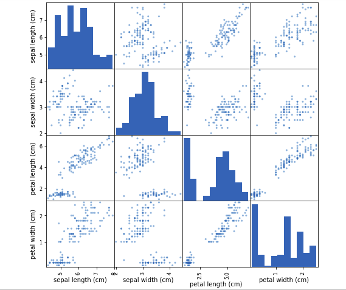 
Petal length and Petal Width shows very high linear correlation ,i.e., they can be compressed down(reduced to its principle components) to a single feature using PCA reduction.  Sepal length and Sepal width are somewhat correlated so they can be reduced too.

We see almost none random distribution of data and clusters are also visible(Obviously deep neural n/ws or even a simple neural n/w will give amazing results but still clustering algo will work good too)

There were 3 classes in the dataset, but still to for experimentation purposes I used Elbow Method to determine the appropriate number of clusters for a dataset. I took number of clusters from 1 to 30 and calculated **average within-cluster sum of squares**(awcss,averaged over 150 so as to not get total wcss which is actually the inertia) for each value and plotted the following curve: 
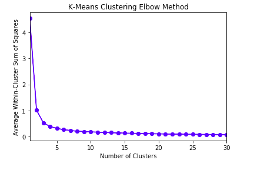 
From the curve, optimal number of clusters is 3 as it right on the elbow(it may seem 4 could be too, but as seen later, it is not)

Then, I performed a PCA reduction to reduce the number of features in our dataset to two(from four). As a result of this reduction, we will be able to visualize each instance as an X,Y data point. Afterwards, re-fit kmeans model to principle components(reduced) with 3 clusters.

## Visualize high dimensional clusters using principle component(using meshgrid)
***number of clusters = 3*** 
 
There are some **misclassifications** : The first is very clearly clustered separately while ther two have some minglings(because **some same species flower may have different chars**). 

>***perfect classification implies homogeniety = 1 and completeness = 1)** 

***number of clusters = 4*** 
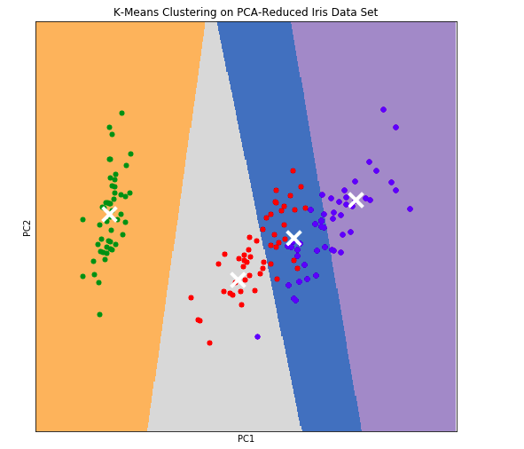 
**Lots of misclassfications!!!!! Not worth it**
## Clustering Metrics
But did the PCA reduction impact the performance of our K means clustering algorithm? Investigate so by using some common clustering metrics:
- **Homogeneity** - measures whether or not all of its clusters contain only data points which are members of a single class.
- **Completeness** - measures whether or not all members of a given class are elements of the same cluster
- **V-measure** - the harmonic mean between homogeneity and completeness

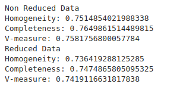 
So metrics were slighly worse with PCA(made more misclassifications in the pca reduced data) because ***during compression you lose some info and clustering is not very accurate but in this case they show similar results(we are still retaining lot of original data in our PCA reduction so yeah it is doing pretty good clustering )*** 
Also this also depended on how those 4 features were correlated with each other(**correlations means a good candidate for PCA**)

## Why Dimensionality Reduction? 
A type of Unsupervised Learning Problem. 
**Motivating Example I: Data Compression**: 
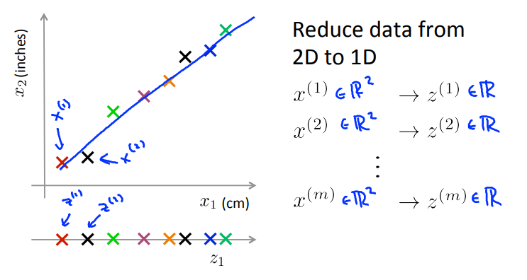 
- find a line on which most of the data seems to lie and project all the data onto that line. To specify the position on the line I need only one number, say z1,**a new feature that specifies the location of each of those points on this green line.**
- in the more typical example of dimensionality reduction we might have a  1000D data reuqired to be  reduced to, say, 100D

If you have hundreds or thousands of features, it is often this easy to lose track of exactly what features you have. Maybe one engineering team gives you two hundred features, a second engineering team gives you another three hundred features, and a third engineering team gives you five hundred features so you have a thousand features all together, and it actually becomes hard to keep track of exactly which features you got from which team, and it's actually not that want to have **highly redundant features** like these. And so if the length in centimeters were rounded off to the nearest centimeter and length in inches was rounded off to the nearest inch. Then, that's why these examples don't lie perfectly on a straight line(**but still enough to show high correlation**).***And if we can reduce the data to one dimension instead of two dimensions, that reduces the redundancy.***

Data compression not only allows us to compress the data and have it therefore use up less computer memory or disk space, but it will also allow us to speed up our learning algorithms.

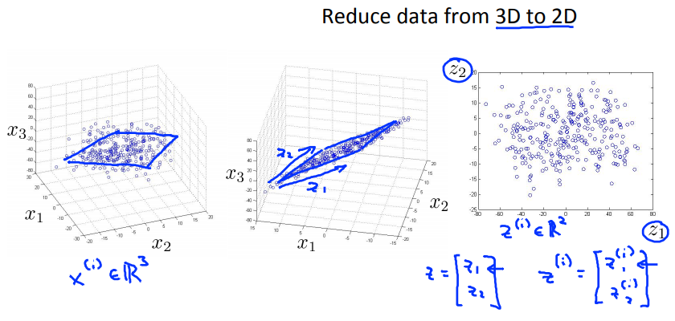 
To represent a plane, two numbers are required, z1 and z2(two components of z). And so z(i) is 2D vector.

**Motivating Example II: Data Visualiation**: 
If you could understand your data better, say, by visualizing it, you can make effective learning algorithms. 
**If you have 50 features, it's very difficult to plot 50-dimensional data. How do you visualize this data? What is a good way to examine this data?** 

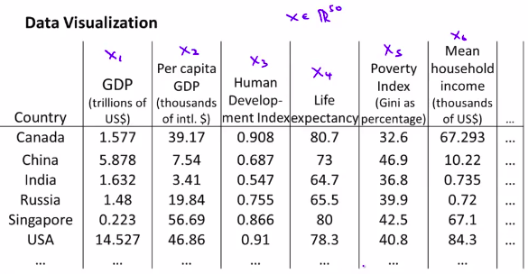 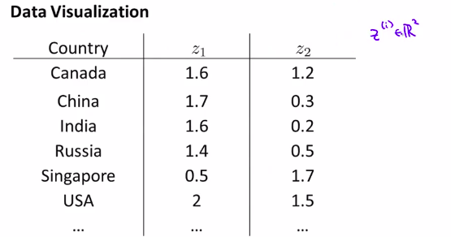 
Using dimensionality reduction, instead of having each country represented by feature vector, x(i), which is 50-dimensional, do a different feature representation that is, these z vectors(R2:has 2 components z1 and z2 that summarize those 50 features).

So plot this as a 2 dimensional plot, and, if you look at the output of the Dimensionality Reduction algorithms, it usually doesn't associates a physical meaning to these new features you want to. **It's often up to us to figure out roughly what these features means.**
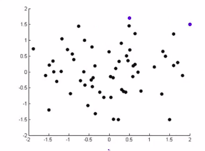 
So, you might find, for example, That the horizontial axis corresponds roughly to the overall country size, or the GDP of a country. Whereas the vertical axis might correspond to the per person GDP or the per person well being, or the per person economic activity.

## [PRINCIPLE COMPONENT ANALYSIS](https://towardsdatascience.com/a-one-stop-shop-for-principal-component-analysis-5582fb7e0a9c)
Algorithm for dimensionality reduction problem.

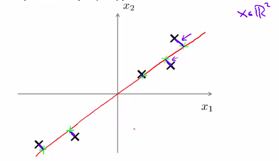 
PCA tries to find a lower dimensional surface (n-dimensional data to be reduced to k-dimensions(k directions or k vectors);a line(single direction) in this case), onto which to project the data so that the projection error(blue line segments) is minimized. 
**Reduce from 2d to 1d: Find a direction, a vector u(1) in Rn(here n=2,cuz that line would have 2 componenets, ex. [ 1  0 ]) to get a line onto which to project the data with minimized projection error ** 
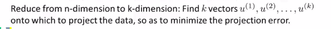 
for 3D->2D, n=3 and k=2
>**Before applying PCA, it's standard practice to first perform mean normalization and feature scaling so that the features x1 and x2 should have zero mean, and comparable ranges of values.** 

### PCA is NOT Linear Regression
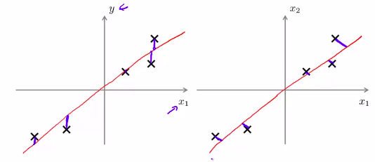 
**LEFT: Linear Regression** We're fitting a straight line so as to minimize the square error between point and the red straight line. We're minimizing the squared magnitude of these **vertical** blue lines. These blue lines are the vertical distance between the point and the value predicted by the hypothesis. Also there is this 'y' we are trying to predict

**RIGHT: PCA** It tries to minimize the magnitude of these blue lines, which are drawn at an angle of 90 deg, the shortest orthogonal distances between the point x and this red line.

