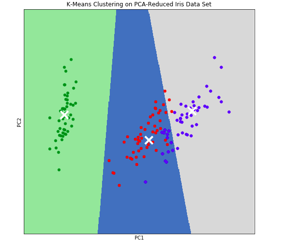

# PCA-for-data-compression
Data Compression and Visualization using Principle Component Analysis (PCA) in Python

## DATASET
I used the standard Iris Dataset from sklearn. No preprocessing was required other than converting the daaset to a pandas dataframe.

## Methodology
 
Petal length and Petal Width shows very high linear correlation ,i.e., they can be compressed down(reduced to its principle components) to a single feature using PCA reduction.  Sepal length and Sepal width are somewhat correlated so they can be reduced too.

We see almost none random distribution of data and clusters are also visible(Obviously deep neural n/ws or even a simple neural n/w will give amazing results but still clustering algo will work good too)

There were 3 classes in the dataset, but still to for experimentation purposes I used Elbow Method to determine the appropriate number of clusters for a dataset. I took number of clusters from 1 to 30 and calculated **average within-cluster sum of squares**(awcss,averaged over 150 so as to not get total wcss which is actually the inertia) for each value and plotted the following curve: 
 
From the curve, optimal number of clusters is 3 as it right on the elbow(it may seem 4 could be too, but as seen later, it is not)

Then, I performed a PCA reduction to reduce the number of features in our dataset to two(from four). As a result of this reduction, we will be able to visualize each instance as an X,Y data point. Afterwards, re-fit kmeans model to principle components(reduced) with 3 clusters.

## Visualize high dimensional clusters using principle component(using meshgrid)
***number of clusters = 3*** 
 
There are some **misclassifications** : The first is very clearly clustered separately while ther two have some minglings(because **some same species flower may have different chars**). 

>***perfect classification implies homogeniety = 1 and completeness = 1)** 

***number of clusters = 4*** 
 
**Lots of misclassfications!!!!! Not worth it**
## Clustering Metrics
But did the PCA reduction impact the performance of our K means clustering algorithm? Investigate so by using some common clustering metrics:
- **Homogeneity** - measures whether or not all of its clusters contain only data points which are members of a single class.
- **Completeness** - measures whether or not all members of a given class are elements of the same cluster
- **V-measure** - the harmonic mean between homogeneity and completeness

 
So we did slighly worse with PCA(made more misclassifications in the pca reduced data) because ***during compression you lose some info and clustering is not very accurate but in this case they show similar results(we are still retaining lot of original data in our PCA reduction so yeah it is doing pretty good clustering )*** 
Also this also depended on how those 4 features were correlated with each other(**correlations means a good candidate for PCA**)

## PCA(PRINCIPLE COMPONENT ANALYSIS)
